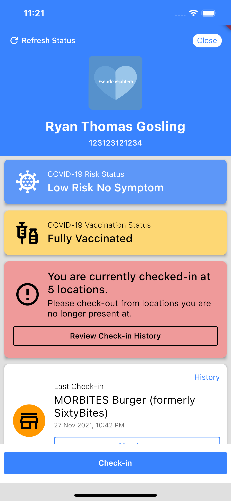
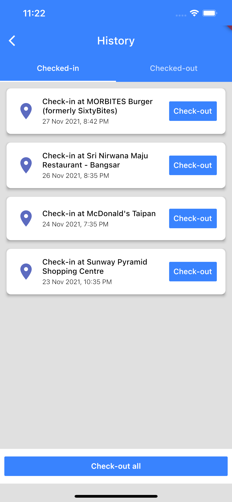
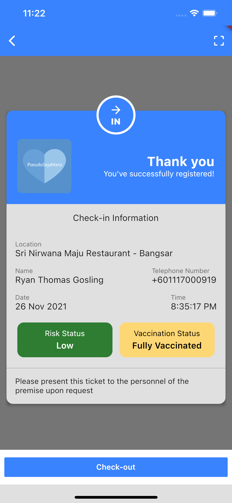

# PseudoSejahtera
### A clone of the [MySejahtera app](https://mysejahtera.malaysia.gov.my/intro/), meant to pump some Dart/Flutter muscles as well as exploring what could be done differently.
 

 

## ⚠️ Important ⚠️
### This mock is NOT developed by the Malaysian Government. It is STRICTLY for educational purposes and is not meant to be used in real world situations.
### For such situations, you should download and use the MySejahtera app.

 

## Setup
### Before trying to run the app locally, run the `build_project.sh` script under the `scripts` folder. This will generate the mocks (for unit test) and retrieve the project dependencies.

