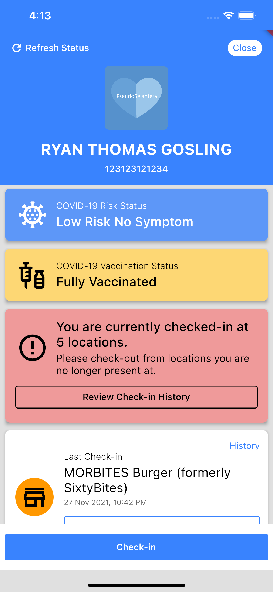

# PseudoSejahtera
### A mock-up of the MySejahtera app (which is developed by the Malaysian Government to mitigate the country's COVID-19 pandemic.)

## Important
### This mock is STRICTLY for educational purposes and is not meant to be used in real world situations.

## Setup
Run `build_project.sh` under the `scripts` folder. This will generate the mocks (for unit test) following by the `flutter pub get` command to retrieve project dependencies.

